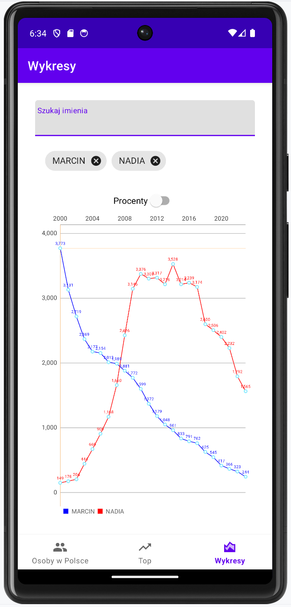
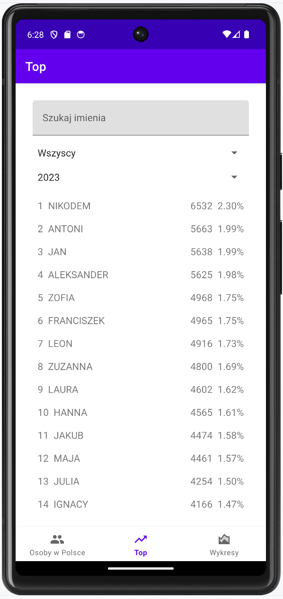
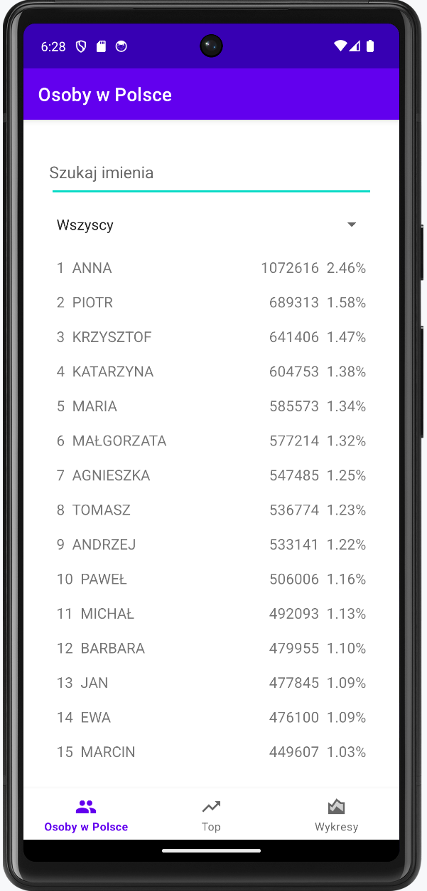

# ImionaTrends

## Overview

**ImionaTrends** is an Android application designed to visualize name trends over time. The application features a chart that displays data related to names and allows users to toggle between absolute values and percentage values.

## Features

- **Search and Auto-Complete**: Users can search for names using an auto-complete text field.
- **Dynamic Charts**: Displays trends of selected names on a line chart.
- **Toggle Percentage Mode**: Switch between absolute values and percentage values on the chart.
- **Chip Group**: Visual representation of selected names for easy removal.

## Architecture

- **MVVM Pattern**: Utilizes the Model-View-ViewModel (MVVM) architectural pattern to separate concerns.
- **LiveData and ViewModel**: Manages UI-related data lifecycle-consciously.

## Components

### `ChartsFragment`

- **Description**: A Fragment that handles the user interface for displaying and managing name trends.
- **Key Elements**:
  - **`AutoCompleteTextView`**: Allows users to search and select names.
  - **`ChipGroup`**: Displays selected names as chips, which can be removed.
  - **`SwitchMaterial`**: Toggles between absolute values and percentage values.
  - **`LineChart`**: Displays the chart of name trends.



### `TopFragment`

- **Description**: A Fragment that handles searching and filtering functionality for names.
- **Key Elements**:
  - **`EditText`**: Allows users to search for names.
  - **`Spinner`**: Dropdowns for selecting gender and year.
  - **`RecyclerView`**: Displays a list of names based on search and filter criteria.
  - **`TextView`**: Shows a message when no data is available.



### `PeopleFragment`

- **Description**: A Fragment that displays a list of people or names.
- **Key Elements**:
  - **`ListView`**: Shows a list of names or people.
  - **`SearchView`**: Provides a search bar to filter the list of names.



## Layouts

### `fragment_charts.xml`

Defines the layout for `ChartsFragment`, including:
- `AutoCompleteTextView` wrapped in `TextInputLayout` for searching names.
- `ChipGroup` to display selected names.
- `SwitchMaterial` for toggling percentage mode.
- `LineChart` to display trends.

### `fragment_top.xml`

Defines the layout for `TopFragment`, including:
- `EditText` for searching names.
- `Spinner` for selecting gender and year.
- `RecyclerView` for displaying search results.
- `TextView` for displaying no data message.

### `fragment_people.xml`

Defines the layout for `PeopleFragment`, including:
- `ListView` for displaying a list of names or people.
- `SearchView` for filtering the list.

## Dependencies

- **Material Components**: For UI components such as `SwitchMaterial`, `ChipGroup`, and `TextInputLayout`.
- **MPAndroidChart**: For charting capabilities.
- **AndroidX Libraries**: For modern Android development practices.

## Getting Started

1. **Clone the Repository**:
    ```bash
    git clone https://github.com/your-repo/imionatrends.git
    ```
2. **Open in Android Studio**:
    - Open Android Studio.
    - Select "Open an existing project".
    - Navigate to the project directory and select it.

3. **Build and Run**:
    - Make sure you have the necessary SDKs and dependencies.
    - Build the project and run it on an emulator or physical device.

## Contributing

Feel free to open issues or submit pull requests if you have suggestions or improvements.

## License

This project is licensed under the MIT License - see the [LICENSE](LICENSE) file for details.

## Acknowledgements

- **MPAndroidChart**: For the charting library.
- **Material Components**: For the modern UI components.

---

For more information, please refer to the documentation or contact the project maintainers.
